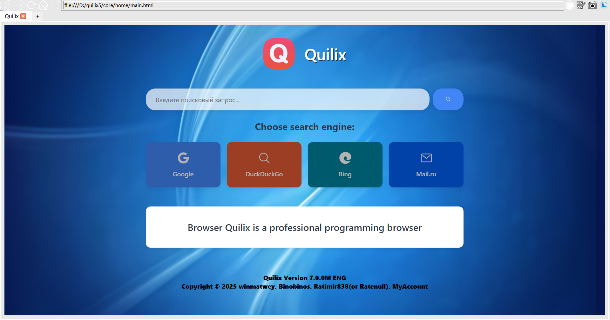

# Quilix Browser - A lightweight and secure browser built with Python

[](https://www.python.org/)
[](https://www.riverbankcomputing.com/software/pyqt/)
[](https://opensource.org/licenses/MIT)

[](CONTRIBUTING.md)

**Quilix** is an experimental browser designed to be lightweight, secure, and customizable. Built with Python and PyQt6,
it aims to provide a clean browsing experience while offering powerful features under the hood.

> **Project Status**: Under active and heavy development. Core features are being implemented and refined.

## ✨ Features & Goals

### 🚀 Implemented

* **Tabbed Browsing**: Full support for multiple tabs.
* **Modern UI**: A clean, minimalist user interface.
* **Theme Support**: Light and dark themes with persistent settings.
* **Session Management**: Browser restores your open tabs and preferences.

### 🧩 Planned

* **🛡️ Enhanced Security**: Advanced protection against trackers, phishing, and malicious scripts.
* **🔌 Extension System**: A framework for community-built extensions.
* **⚙️ Advanced Settings**: Granular control over browser behavior and privacy.
* **🌐 Web Engine Improvements**: Better compatibility and performance.

## 🛠️ For Developers

### Tech Stack

* **Backend**: Python 3.12+
* **GUI Framework**: PyQt6
* **Version Control**: Git + GitHub with PR-based workflow
* **Code Quality**: Enforced use of `ruff`, `pylint`, `mypy`, and semantic commit messages.

### Getting Started

1. **Clone the repository**:
   ```bash
   git clone https://github.com/Binobinos/Quilix.git
   cd Quilix
   ```

2. **Install dependencies** (recommended within a virtual environment):
   ```bash
   pip install -r requirements.txt
   ```

3. **Run the browser**:
   ```bash
   python ./core/main.py
   ```

## 🤝 Contributing

We are open to and grateful for any contributions! The project needs help in many areas:

* **Python Developers**: Help us build core features like the download manager, security systems, and performance
  optimizations.
* **UI/UX Designers**: Improve the interface, create new themes, and enhance the user experience.
* **Testers**: Report bugs, test new features on different operating systems.
* **Documentation**: Help us write better docs and guides.

Please read our [Contributing Guidelines](CONTRIBUTING.md) (to be created) before submitting a Pull Request. We follow a
strict code review process to maintain quality.

### 💬 Get in Touch

* For technical discussions and code reviews, please open a GitHub **Issue** or **Discussion**.
* You can also reach the core team on Telegram: **@winmkz**

## 👥 The Team

Quilix is developed by a dedicated team of open-source contributors.

| Role                              | Name           | GitHub                                            | Contact         |
|:----------------------------------|:---------------|:--------------------------------------------------|:----------------| 
| **Project Lead & Core Developer** | M. Binobinos   | [@Binobinos](https://github.com/Binobinos)        | `@binobinos`    |
| **Author&browser core developer** | Matwey B.      | [@winmatwey](https://github.com/winmatwey)        | `@winmkz`       |
| **Core Developer**                | My Account.    | [@myaccountry](https://github.com/myaccountry)    | `@grannev`      |
| **UI/UX Designer**                | Ratimir        | [@Ratimir838](https://github.com/Ratimir838)      | `@Ratenull`     |
| **Build & Packaging**             | logqch         | -                                                 | `@logqch`       |
| **Packaging**                     | Anoop Software | [anoop14613742](https://github.com/anoop14613742) | `@anoopsoftware`|
## 📜 License

This project is licensed under the **MIT License**. See the [LICENSE](LICENSE) file for details.

## 📦 Packaging & Distribution

The project includes cross-platform build scripts using **PyInstaller** to generate:

* Windows portable folder (`Quilix/Quilix.exe`) or single-file executable
* macOS `.app` bundle and optional compressed `.dmg`

### ✅ Prerequisites

Install Python 3.12+ and required dependencies:

```bash
pip install -r requirements.txt
pip install pyinstaller
# (macOS only if building DMG via dmgbuild)
pip install dmgbuild
```

> PyQt6-WebEngine dramatically increases bundle size. One-folder mode is recommended for easier debugging.

### 🪟 Build on Windows

Run (from project root):

```powershell
powershell -ExecutionPolicy Bypass -File build\build_windows.ps1
```

Optional single-file build:

```powershell
powershell -ExecutionPolicy Bypass -File build\build_windows.ps1 -OneFile
```

Outputs:
* `dist/Quilix/Quilix.exe` (default)
* `dist/Quilix.exe` (one-file)

### 🍎 Build on macOS

```bash
bash build/build_macos.sh            # .app bundle
bash build/build_macos.sh --dmg      # also create Quilix.dmg
bash build/build_macos.sh --onefile  # one-file (not recommended for WebEngine)
```

Outputs:
* `dist/Quilix.app`
* `dist/Quilix.dmg` (if `--dmg`)

### 🔐 Code Signing (Optional)

For macOS Gatekeeper:

```bash
codesign --deep --force --options runtime --sign "Developer ID Application: Your Name" dist/Quilix.app
```

For Windows SmartScreen (requires EV cert for best UX) use **signtool**:

```powershell
signtool sign /tr http://timestamp.sectigo.com /td sha256 /fd sha256 /a dist\Quilix\Quilix.exe
```

### 🧪 Quick Test of Frozen App

Run the executable and verify:

* Home page loads (`core/home/main.html` → packaged as `home/main.html`)
* Icons and styles switch when toggling theme
* Creating new tabs works & session persists

If resources are missing, confirm they exist inside `dist/Quilix/` under `icons/`, `styles/`, `home/`.

### 🛠 Troubleshooting

| Issue | Cause | Fix |
|-------|-------|-----|
| Blank window / crash | Missing WebEngine process | Ensure matching PyQt6 and WebEngine versions (see requirements) |
| Icons not showing | Relative path failure | Runtime hook sets CWD; ensure running from produced folder, not copying exe alone (except one-file mode) |
| One-file slow first start | App self-extracts | Use one-folder for dev/testing |
| macOS cannot open app | Unsigned app blocked | Right-click → Open once or sign/notarize |
| DMG not created | Missing tool | Install `dmgbuild` or `brew install create-dmg` |

### 📐 Future Improvements

* Add GitHub Actions workflow for automatic artifact builds
* Convert `icon.ico` to platform `.icns` for macOS branding
* Enable UPX only after validating stability
* Embed version dynamically from `config.__version__`

---

For questions about distribution, open an Issue with the label `packaging`.
